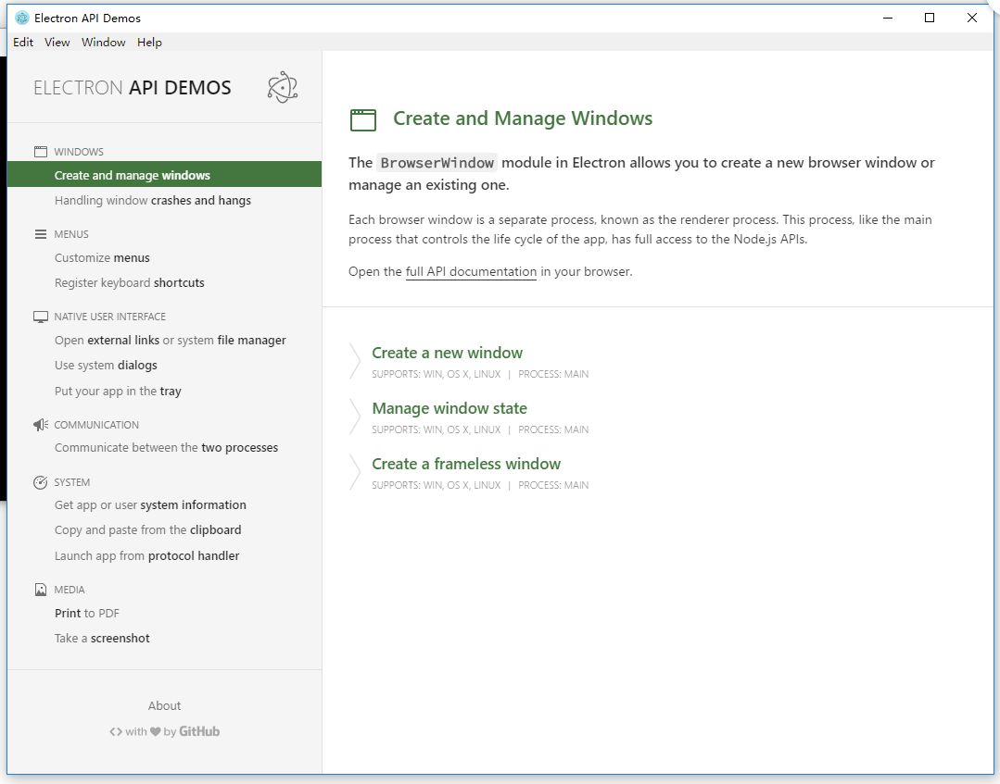

## Electron
electron是github开源的跨OS平台的桌面应用开发平台，通过JavaScript,CSS,HTML 技术就可以开发桌面客户端应用，同时集成 Node 来授予网页访问底层系统的权限。

所以，前端工程师也可以开发酷炫的桌面应用了！

## 本地安装electron
1. 安装node.js 和 git
2. 安装cnpm, 淘宝的npm源，下载速度快很多  

    `npm install -g cnpm --registry=https://registry.npm.taobao.org`

3. cnpm install electron -g
4. electron -v   查看安装版本说明安装成功

注意：运行时需要你的系统已经安装了 Git 和 Node.js（包含 npm）。

## 快速入门
<pre>#克隆这仓库  
$ git clone https://github.com/electron/electron-quick-start
# 进入仓库
$ cd electron-quick-start
# 安装依赖库并运行应用
$ npm install && npm start
</pre>

这个是electron api demo的例子，启动后，会显示界面，可以看到有菜单栏，最小化，最大化，关闭按钮，用web技术就可以创建本地客户端，借助electron api可以做很多事情。




## 例子
大体上，一个 Electron 应用的目录结构如下：

<pre>your-app/
├── package.json
├── main.js
└── index.html
</pre>

package.json的格式和 Node 的完全一致，main.js 是应用的启动脚本，它运行在主进程上。应用里的 package.json 看起来应该像：

```
{
  "name"    : "your-app",
  "version" : "0.1.0",
  "main"    : "main.js"   //注意：没有声明，Electron会优先加载 index.js。
}
```

main.js 应该用于创建窗口和处理系统事件，一个典型的例子如下：

```js
const electron = require('electron');
// 控制应用生命周期的模块。
const {app} = electron;
// 创建原生浏览器窗口的模块。
const {BrowserWindow} = electron;

const path = require('path');

// 保持一个对于 window 对象的全局引用，如果你不这样做，
// 当 JavaScript 对象被垃圾回收， window 会被自动地关闭
let mainWindow;

function createWindow() {
  // 创建浏览器窗口。
  mainWindow = new BrowserWindow({
      width: 800,
      height: 600,
      backgroundColor: '#FFF',
      alwaysOnTop:false,
      frame: false,
      titleBarStyle: 'hidden' // macos 支持隐藏标题栏
      // transparent: true
  });

  // 加载应用的 index.html。
  const file = path.join('file://', __dirname, 'index.html')

  //mainWindow.loadURL(`http://url/`);
  mainWindow.loadURL(file);

  // 启用开发工具。
  mainWindow.webContents.openDevTools();

  // 当 window 被关闭，这个事件会被触发。
  mainWindow.on('closed', () => {
    // 取消引用 window 对象，如果你的应用支持多窗口的话，
    // 通常会把多个 window 对象存放在一个数组里面，
    // 与此同时，你应该删除相应的元素。
    mainWindow = null;
  });
}

// Electron 会在初始化后并准备
// 创建浏览器窗口时，调用这个函数。
// 部分 API 在 ready 事件触发后才能使用。
app.on('ready', createWindow);

// 当全部窗口关闭时退出。
app.on('window-all-closed', () => {
  // 在 macOS 上，除非用户用 Cmd + Q 确定地退出，
  // 否则绝大部分应用及其菜单栏会保持激活。
  if (process.platform !== 'darwin') {
    app.quit();
  }
});

app.on('activate', () => {
  // 在 macOS 上，当点击 dock 图标并且该应用没有打开的窗口时，
  // 绝大部分应用会重新创建一个窗口。
  if (mainWindow === null) {
    createWindow();
  }
});

```

命令行里执行启动应用：

`electron .`


## 打包分发

通过第三方的打包工具实现，官方推荐的有2个工具：

[electron-packager](https://github.com/electron-userland/electron-packager)  
[electron-builder](https://github.com/electron-userland/electron-builder)

我们以electron-builder为例，看看怎么打包。

```
"scripts": {
  "start": "npm install && electron .",
  "pack": "build --dir",
  "dist": "build",
  "release": "build"
},
```

scripts 定义了可执行的命令，比如 npm run pack ,就会执行 build --dir , build是下面定义的：

```
{
  "name": "AMS",
  "productName": "",
  "version": "1.0.0",
  "description": "",
  "author": "",
  "license": "MIT",
  "keywords": [
    ""
  ],
  "private": true,
  "main": "main.js",
  "scripts": {
    "start": "npm install && electron .",
    "pack": "build --dir",
    "dist": "build",
    "release": "build"
  },
  "build": {
    "appId": "org.ams",
    "category": "act.ams",
    "dmg": {
      "contents": [
        {
          "x": 110,
          "y": 150
        },
        {
          "x": 240,
          "y": 150,
          "type": "link",
          "path": "/Applications"
        }
      ]
    },
    "win": {
      "remoteReleases": "",
      "publish": [
        "github",
        "bintray"
      ]
    },
    "linux": {
      "publish": null,
      "target": [
        "deb",
        "AppImage"
      ]
    }
  },
  "standard": {
    "env": {
      "mocha": true
    }
  },
  "devDependencies": {
    "electron": "1.4.3",
    "electron-builder": "^7.13.0"
  }
}
```

执行 npm run pack 后，会自动创建 dist 目录， 同时生成对应平台的安装包（免安装），解压后即可在其他电脑上运行。


## 学习资料
http://get.ftqq.com/7870.get   
http://www.doornt.com/2016/04/26/electron-制作windows安装包-升级/  
http://doc.yzone.net/electron/docs-translations/zh-CN/faq/electron-faq.md
